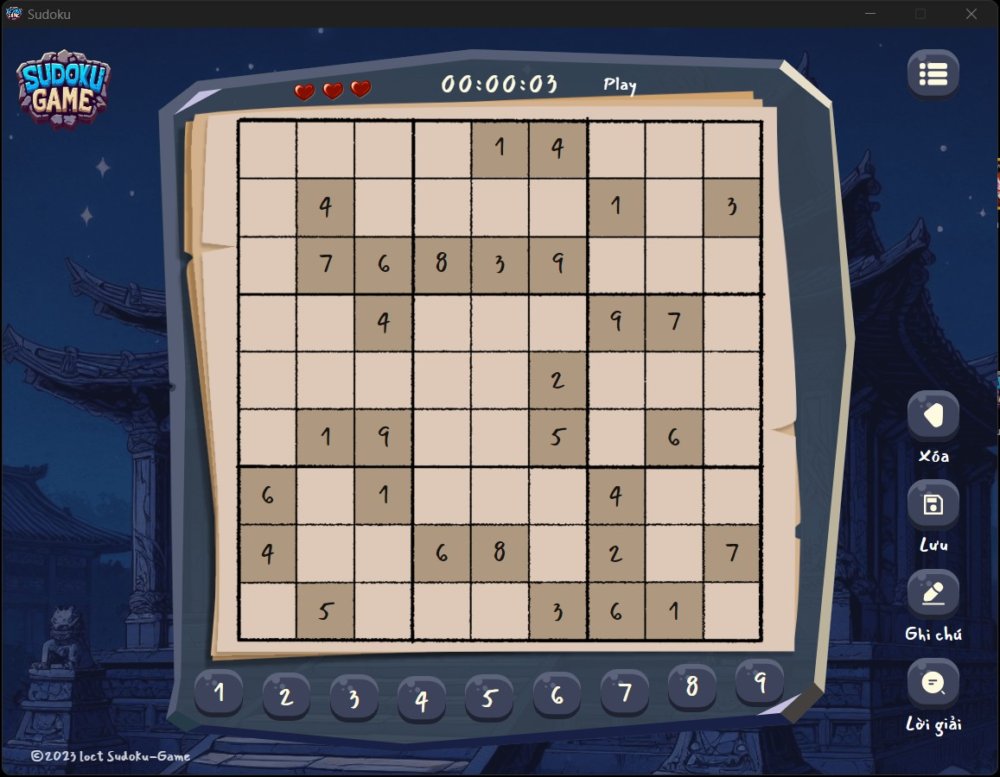
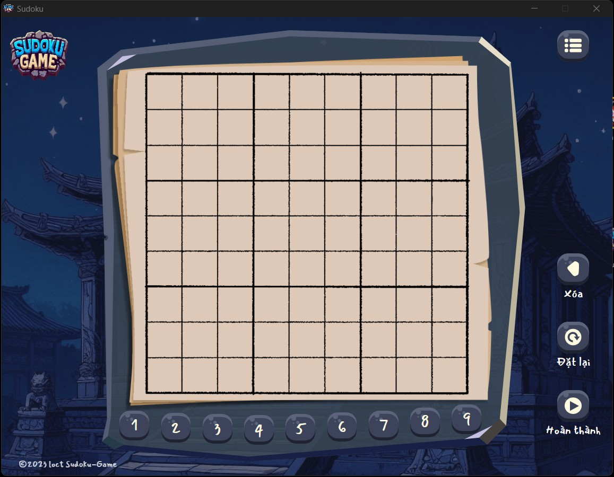
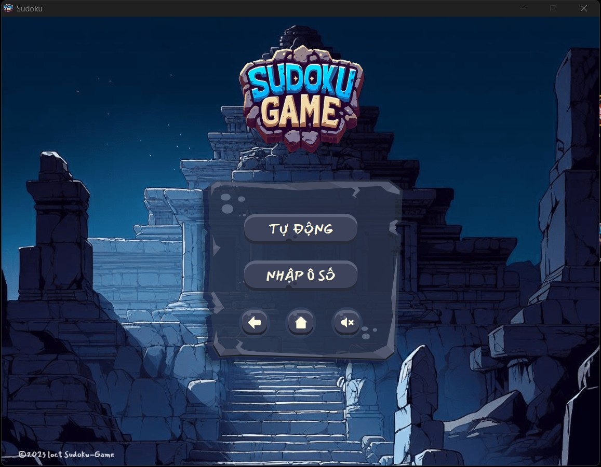
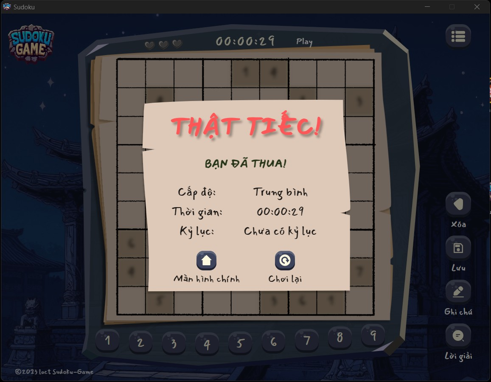

# SUDOKU GAME

Play Sudoku puzzle offline on your desktop! 🎮

Welcome to Sudoku Game, a desktop application developed by Electron and ReactJs.

## 🖥️ Tech Stack

**Frontend:**

&nbsp;
&nbsp;
&nbsp;
&nbsp;

**Template:**

[](https://github.com/electron-react-boilerplate/electron-react-boilerplate)

**UI Design:**

[](https://www.figma.com/file/ZDgSiACwATcaH5BQl1Jq4M/Sudoku-Game?type=design&mode=design&t=VlKN4Wjy4fPhS1zt-1)

<a href="https://www.figma.com/file/ZDgSiACwATcaH5BQl1Jq4M/Sudoku-Game?type=design&mode=design&t=VlKN4Wjy4fPhS1zt-1">Open Design</a>

## 🤖 Features

- Create a new game.
- Continue the previous game.
- Saves the state of the Sudoku board being played and can be reopened.
- Generate Sudoku numbers automatically.
- Enter numbers manually in each cell on an empty table.
- Enter number cells using a .txt file in SudoKu table format.
- There are 3 levels: easy, medium, difficult.
- Timer during game playing.
- Record the highest score for each level.
- Pause/Continue game.
- Turn on/off game sound.

## 📸 Game Screen


https://github.com/locT-581/sudoku-game/assets/132336957/d06f8b39-77a2-4fe4-8511-238a1900e852

<table>
  <tr>
    <td></td>
    <td></td>
  </tr>
  <tr>
    <td></td>
    <td></td>
  </tr>
</table>

## Install

Clone the repo and install dependencies:

```bash
npm install
```

## Starting Development

Start the app:

```bash
npm start
```

<h2>📬 Contact</h2>

If you want to contact me, you can reach me through below handles.

[](https://www.linkedin.com/in/tr%E1%BA%A7n-nguy%E1%BB%85n-h%E1%BB%AFu-l%E1%BB%99c-b11a15274?lipi=urn%3Ali%3Apage%3Ad_flagship3_profile_view_base_contact_details%3B5WbL0BKYSH%2Bc335V0ESiPQ%3D%3D)

© 2023 LocT
